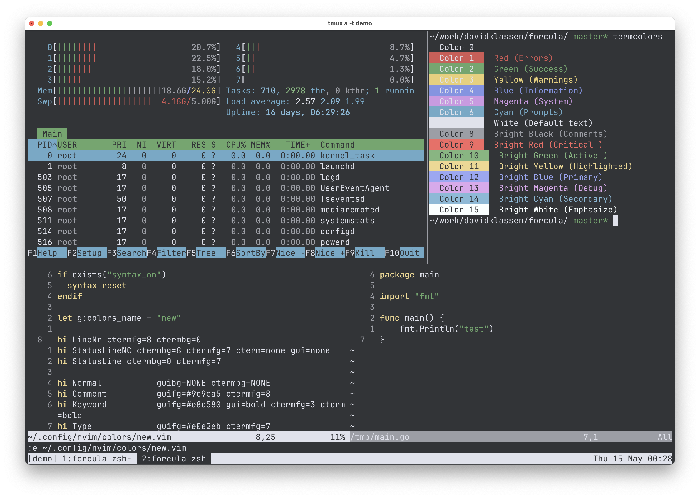

# ANSI Colors

- 0 - Black (background): #323437
- 1 - Red (errors): #e67a73
- 2 - Green (success, strings): #7ec484
- 3 - Yellow (warnings): #f0e895
- 4 - Blue (information): #9aa4f8
- 5 - Magenta (system): #d696e7
- 6 - Cyan (prompts): #98ddff
- 7 - White (foreground, normal text): #e0e2eb

- 8 - Bright Black/Gray (comments): #9c9ea5
- 9 - Bright Red (critical): #ff918b
- 10 - Bright Green (active): #95e09c
- 11 - Bright Yellow (highlighted): #fff0a0
- 12 - Bright Blue (primary): #afb9ff
- 13 - Bright Magenta (debug): #f0a8ff
- 14 - Bright Cyan (secondary): #b0edff
- 15 - Bright White (emphasized): #faffff

